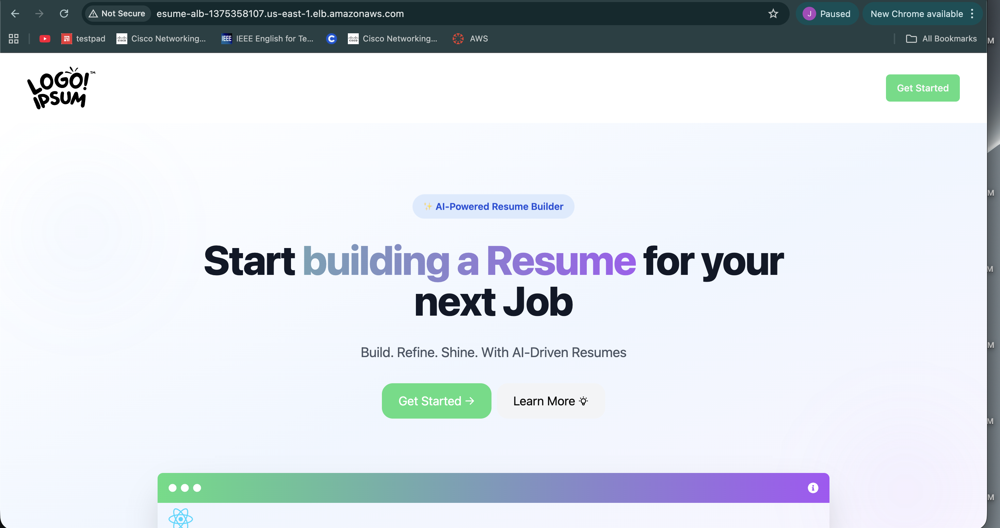
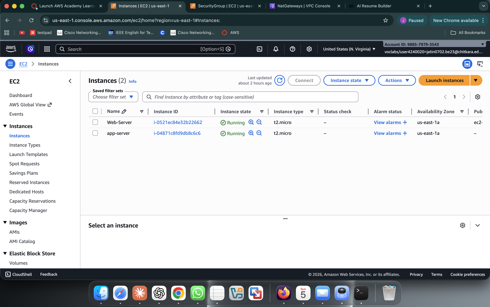
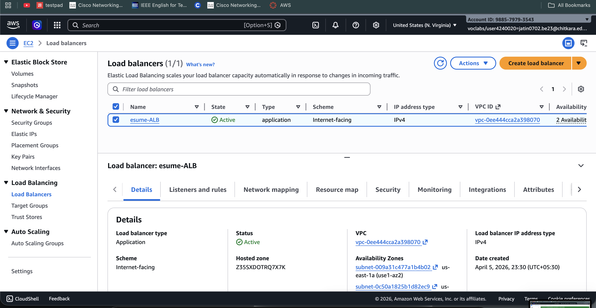
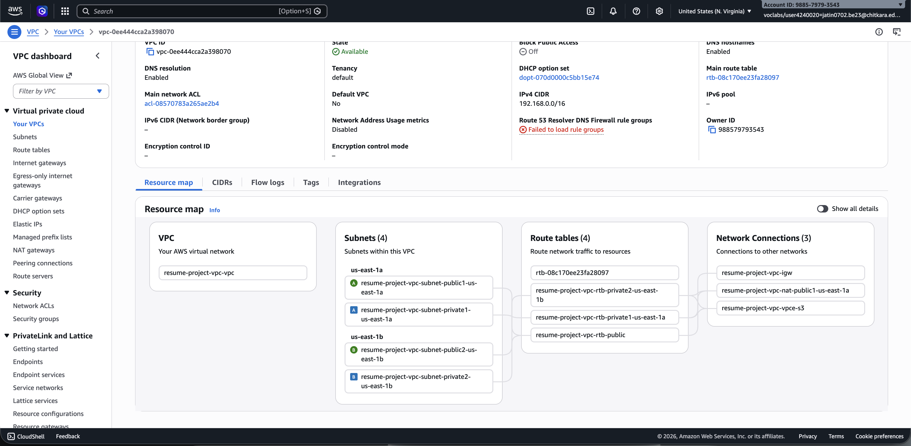
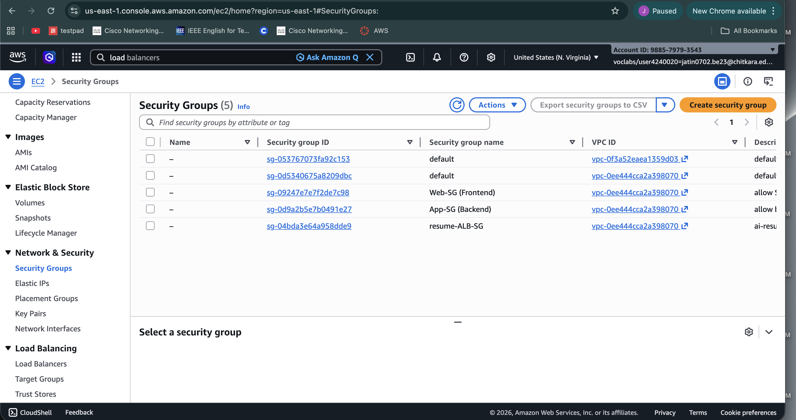
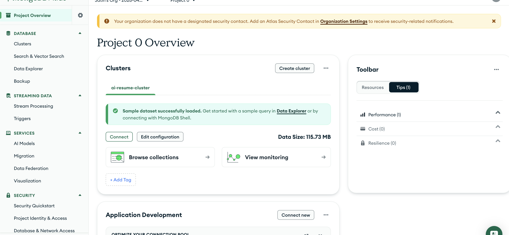

# 🚀 AI Resume Builder

AI Resume Builder is a full-stack web application that helps users create professional resumes using AI-powered suggestions. The project demonstrates both modern web development and real-world DevOps deployment on AWS.

---

## 🌟 Features

- AI-powered resume content generation  
- User authentication (Login/Signup)  
- Dynamic resume creation & editing  
- Customizable resume templates  
- Download and share resumes  
- Deployed using AWS and Docker  

---

## 🧱 Architecture

User → Application Load Balancer → Frontend (EC2) → Backend (EC2) → MongoDB Atlas  

---

## ⚙️ Tech Stack

### Frontend
- React.js  
- Tailwind CSS  
- Redux Toolkit  

### Backend
- Node.js  
- Express.js  

### Database
- MongoDB Atlas  

### DevOps & Cloud
- AWS (EC2, VPC, ALB, Security Groups)  
- Docker  
- Nginx  

---

## 🚀 Deployment Overview

- Created custom VPC with public & private subnets  
- Deployed frontend and backend on separate EC2 instances  
- Containerized both services using Docker  
- Configured Nginx as reverse proxy  
- Set up Application Load Balancer  
- Connected backend to MongoDB Atlas  

---

## 🛠️ Installation

### Without Docker

```bash
git clone https://github.com/jatinpatter/Ai-resume-Builder.git
cd Ai-resume-Builder

cd Backend
npm install
npm run dev

cd ../Frontend
npm install
npm run dev
```

### With Docker

```bash
docker build -t frontend ./Frontend
docker build -t backend ./Backend

docker run -d -p 8085:80 frontend
docker run -d -p 9095:9095 backend
```

---


## 📸 Screenshots

### 🌐 Application UI
<p align="center">
  
</p>

### ☁️ AWS Infrastructure

<p align="center">
  
  
</p>

<p align="center">
  
  
</p>

### 🗄️ Database 

<p align="center">
  
</p>

## 🤝 Contribution

- Application code developed by project contributors  
- DevOps deployment and AWS architecture implemented by me  
- Dockerized frontend and backend  
- Configured load balancing and networking  

---

## 👨‍💻 Developers


- Chirag (Frontend & Backend)
- Jatin (DevOps & Cloud)  
  

---

## 🔥 Outcome

- Deployed a scalable full-stack app on AWS  
- Implemented real-world DevOps practices  
- Built production-like cloud architecture  

---
